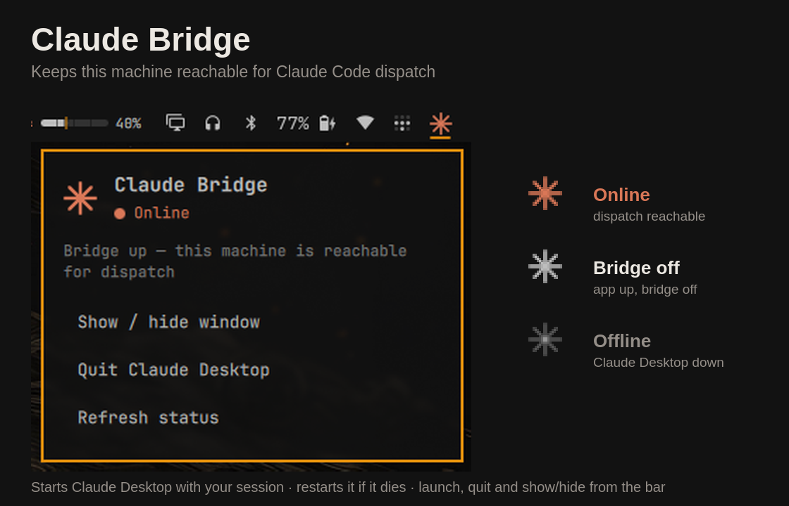

# Claude Bridge

**Keeps this machine reachable for Claude Code dispatch** — so you can start a new
session from your phone or from claude.ai and have it run here, without setting
anything up first.

Claude Desktop is what hosts that bridge, so the bridge is only up while it is running.
This plugin makes sure it is: it starts Claude Desktop with your session, brings it back
if it dies, and parks its window on a hidden workspace rather than quitting it to get it
out of the way. A bar icon confirms the bridge is live at a glance, and a menu gives you
launch, quit, and show/hide.

Closing Claude Desktop's window only hides it to the tray, so "is the window open" tells
you nothing about whether dispatch works. This answers the question that actually
matters — and acts on it.



> **Recommended: have a coding agent install this.** Setup touches your Hyprland
> config — an autostart entry, a window rule and a keybinding — and those differ by
> Hyprland version, by config layout (Lua vs `.conf`), and by which keys you already
> have bound. An agent reconciles that against your actual machine; a copy-pasted
> snippet cannot.
>
> Point Claude Code at this repo and say:
>
> ```
> Install https://github.com/banxxrr/claude-bridge and follow its SETUP.md
> ```
>
> [SETUP.md](SETUP.md) is written for that: it states the desired end state and the
> constraints rather than a fixed list of commands. Prefer to do it by hand? See
> [Install](#install) below — `./setup.sh --dry-run` prints every change before it
> makes one.

## Always on

| Setting | Default | Behaviour |
|---------|---------|-----------|
| `autostart` | `true` | Starts Claude Desktop when the bar loads, i.e. every login |
| `keepAlive` | `true` | Restarts it if it exits unexpectedly |

**A deliberate quit is respected.** Quitting from the widget sets a hold, so `keepAlive`
will not immediately undo what you asked for. The hold clears as soon as something
starts Claude Desktop again — the menu, the autostart at your next login, or you
launching it by hand.

That state is a file under `$XDG_RUNTIME_DIR/claude-bridge/`, not memory, because a bar
surface exists per monitor and each one supervises independently. On a multi-monitor
setup, per-instance state means the copy you clicked stays quiet while its peers
relaunch the app you just quit. The same directory holds a launch stamp so several
instances noticing the outage on the same tick cannot each spawn a copy.

Set either to `false` on the widget's entry in `~/.config/omarchy/shell.json` if you
would rather manage Claude Desktop yourself.

## The icon

| Icon | Meaning |
|------|---------|
| Orange sunburst | Bridge up — this machine is reachable for dispatch |
| Plain white | Claude Desktop is running, but the bridge is not enabled |
| Faded | Claude Desktop is not running — dispatch unavailable |

Colour appears **only** when dispatch genuinely works, so a glance at the bar is enough.

## Actions

Click the icon for a menu showing the state plus the relevant actions. Quick actions
are also on the icon itself:

| Input | Action |
|-------|--------|
| Left click | Open the menu |
| Middle click | Quit Claude Desktop |
| Right click | Refresh status |

Menu entries adapt to the state: *Launch Claude Desktop* when it is down, *Show / hide
window* and *Quit Claude Desktop* when it is up.

## Install

```sh
omarchy plugin add https://github.com/banxxrr/claude-bridge.git --enable
```

Then place it on the bar if it did not land where you want:

```sh
omarchy bar move banxxrr.claude-bridge --section right
```

## Removing it

```sh
omarchy plugin remove banxxrr.claude-bridge
```

That takes the widget off the bar and deletes the plugin. It does not touch the
Hyprland config, so if you ran `setup.sh`, undo those three blocks too — each is
tagged with a `claude-bridge` comment, and `setup.sh` left a timestamped `.bak`
beside every file it edited:

```sh
grep -rn claude-bridge ~/.config/hypr/*.lua
```

Nothing else persists. The only runtime state is `$XDG_RUNTIME_DIR/claude-bridge/`,
which is cleared on reboot, and Claude Desktop itself is left installed and running.

## Dependencies

Beyond the Omarchy shell and Claude Desktop, the helpers use only standard
userland: `sh`, `pgrep`, `readlink`, `awk`, `stat`, `date`, `kill`, and `hyprctl`
for the workspace toggle. Launching prefers `uwsm-app` when the session provides
it, and falls back to `gtk-launch` or `flatpak` depending on how Claude Desktop
was installed. No runtime, interpreter, or library is bundled or required.

## Compatibility

**Claude Desktop — install method independent.** Detection reads Electron's
`SingletonLock` in Claude Desktop's user-data directory (a `<hostname>-<pid>` symlink
that every build writes and removes on a clean exit), and confirms the pid against
`/proc`. The user-data directory is discovered rather than assumed, covering
`$XDG_CONFIG_HOME`, `~/.config/Claude`, and Flatpak's `~/.var/app/*/config/Claude`.

- **Tested:** the AUR `claude-desktop` package on Arch.
- **Best effort, untested:** Flatpak and other packagings. The detection and the
  launcher are written for them, but nobody has run them there. Reports welcome.

Launching tries, in order: a `claude-desktop` binary on `PATH` (wrapped in `uwsm-app`
when the session provides it), a `.desktop` entry via `gtk-launch`, then
`flatpak run com.anthropic.Claude`.

**Hyprland — both dispatch syntaxes.** Omarchy's Lua-configured Hyprland rejects the
classic `dispatch togglespecialworkspace <name>` form, while a stock `.conf` Hyprland
has no `hl.dsp` table. The widget tries one and falls back to the other, so it works on
both.

**Required:** the Omarchy shell (Quickshell). This is an Omarchy bar widget and does not
run standalone.

## Setup for "Show / hide window"

Run the installer, which is idempotent and can preview itself:

```sh
./setup.sh --dry-run   # show what it would change
./setup.sh             # apply, backing up each file first
```

It detects Lua vs `.conf` Hyprland layouts, refuses to clobber an existing
keybinding, and validates with `hyprctl configerrors` before reporting success.
For a manual or agent-driven setup, see [SETUP.md](SETUP.md).


This action toggles a Hyprland **special workspace**, which keeps Claude Desktop alive
and hidden rather than quitting and relaunching it — so the bridge never drops. It only
does something once Claude Desktop actually lives on that workspace.

Until Claude Desktop is actually parked on `special:claude`, the action toggles an
empty workspace and appears to do nothing.

On a multi-monitor setup the special workspace opens on whichever monitor has focus.
That is Hyprland's behaviour, not the widget's.

## Configuration

Set on the widget's entry in `~/.config/omarchy/shell.json`:

| Key | Default | Meaning |
|-----|---------|---------|
| `refreshIntervalSec` | `5` | How often to poll, in seconds (2–300) |
| `specialWorkspace` | `claude` | Name of the special workspace to toggle |

## Troubleshooting

**Edits to the plugin do not take effect.** Omarchy's plugin hot-reload is unreliable
for this widget — several consecutive edits can produce no visible change. Force it:

```sh
omarchy restart shell
```

**Inspect state from the shell.** The widget exposes an IPC surface:

```sh
omarchy-shell banxxrr.claude-bridge.control status       # human-readable state
omarchy-shell banxxrr.claude-bridge.control environment  # dispatch environment id
omarchy-shell banxxrr.claude-bridge.control lastcmd      # exact argv of the last action
omarchy-shell banxxrr.claude-bridge.control supervision  # autostart/keepAlive, and whether a quit is being held
omarchy-shell banxxrr.claude-bridge.control launch       # launch / quit / toggle / refresh
```

`lastcmd` is the fastest way to debug a wrong `specialWorkspace` name.

**The icon is stuck faded.** Run `sh status.sh` from the plugin directory. If it prints
`running=0` while Claude Desktop is clearly open, your install is not being detected —
please open an issue with the output and your install method.

## A note on what this reads

Bridge state comes from `bridge-state.json`, which is Claude Desktop's own undocumented
file. Anthropic can rename those fields in any update. When the file cannot be parsed
the widget degrades to process-only detection and says so ("bridge state unreadable")
rather than silently going dark.

## License

MIT — see [LICENSE](LICENSE).
